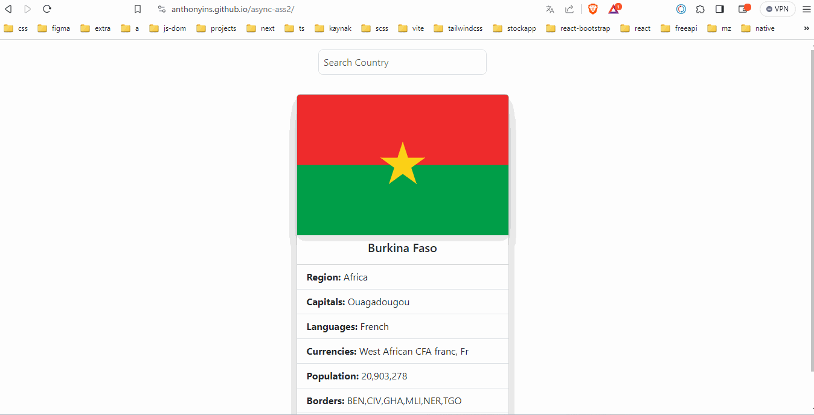

# ASS-4 Country App

## Pekiştirilmesi Beklenen Konular

- fetch()
- async-await
- try-catch
- Array Methods
- Js DOM

## Beklenenler

- Sayfa açıldığında aşağıda verilen api adresine fetch() ve async-await ile try-catch bloğunu kullanarak istek atınız. Gelen cevabı bir değişkende saklayınız.
- Sayfa açıldığında gelen cevaptan herhangi bir ülke bilgisini ekrana yazdırınız. Random olarak da seçebilirsiniz veya statik olarak da belirleyebilirsiniz.
- Search inputuna "input" eventı ekleyiniz. Kullanıcı her inputa veri girdiğinde searchDiv elementinin içerisine ülke isminde o harfleri içeren ülkelerin adını yazdırınız. (API den gelen responsu sakladığınız arraye Array iterasyon metodlarından uygun olanı uygulayabilirsiniz.)
- Kullanıcı çıkan div içerisinden seçim yapabilsin, tıkladığı ülkenin bilgileri ekrana gelsin. Ve seçim yaptıktan sonra searchDiv elementinin içerisi temizlensin. Sadece input içerisinde o ülkenin ismi kalsın
- Kullanıcının yazdığı ülke ismi eğer tek bir ülke ile eşleşirse kullanıcı seçim yapmadan ülke verisi ekrana gelsin.
- Ülke bilgilerini UI'ya yazdırırken html tarafında verdiğimiz yapıyı uygun yerlere uygun veriler gelecek şekilde kullanabilirsiniz.

## Beklenen Çıktı

## Demo
[Live](https://anthonyins.github.io/async-ass2/)

## API

- Kullanacağınız API adresi => https://restcountries.com/v3.1/all

## Not 

- Verdiğimiz [templatei](./index.html) kullanabilirsiniz. Örnek amaçlı UI için html tarafındaki örneklerden ilham alabilirsiniz veya kendiniz daha özgün yapılar hazırlayabilirsiniz.
- Hata durumunda ekrana uyarı çıkartabilirsiniz.

